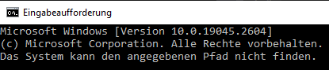
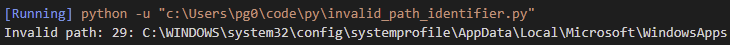
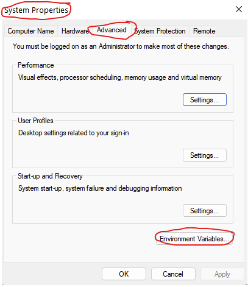
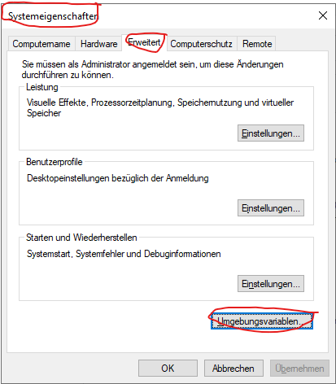
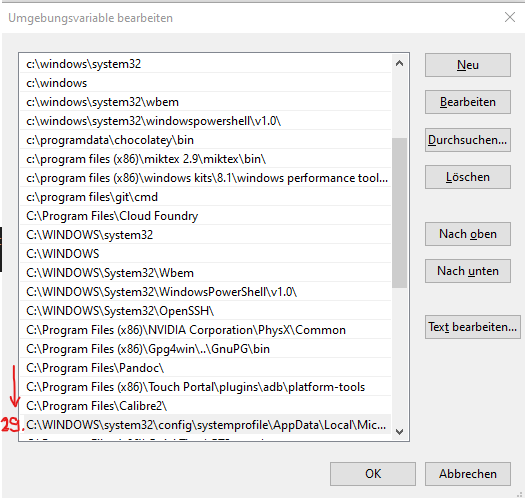

# invalid_path_identifier

python script to identify invalid windows system path

## error
    "The System Cannot Find The Path Specified" (EN)
    "Das System kann den angegebenen Pfad nicht finden." (DE)

## usage
`python invalid_path_identifier.py`

the script returns: the path variable number + invalid path

## steps to resolve the error

which can be found and removed through

    WIN-Key + R
    rundll32.exe sysdm.cpl,EditEnvironmentVariables

or via mouse

    WIN-Key -> SystemEnvironment Variables (EN)
    -> Environment Variables...
    
    WIN-Taste -> Systemumgebunsvariablen bearbeiten (DE)
    -> Umgebungsvariablen
    
 
    

select the top entry, click ARROW-DOWN as much times as the number says

in the example 29 times

